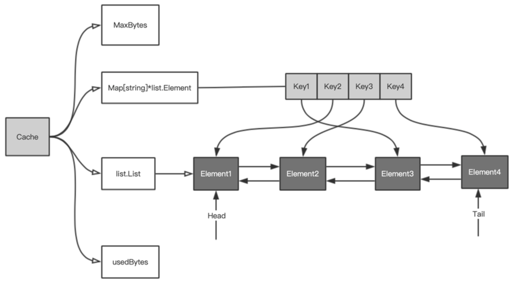
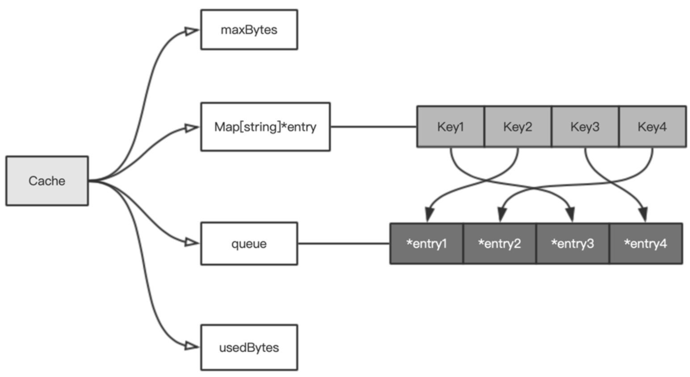
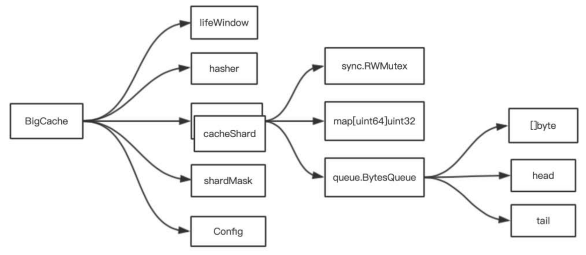

## 进程内缓存的应用场景

- 只读数据，可以考虑在进程启动时加载到内存，例如配置信息
- 高并发，例如秒杀时
- 在一定程度上允许分布式不同节点的数据不一致。例如，一些计数场景或运营场景，页面对数据一致性要求较低，这时可以考虑使用进程内页面缓存
- 对性能要求极高，进程外缓存的网络开销无法满足需求

## 缓存淘汰算法
- FIFO 先进先出：双向链表（先进先出队列）

    

    - 优点：实现简单，时间复杂度 $O(1)$
    - 缺点：最早添加的数据如果也是最常被访问的，将被一直被淘汰、一直被添加（抖动）

- LFU 最少使用：按照访问次数排序的队列（优先队列）

    

    - 优点：缓存命中率高
    - 缺点：
        - 维护堆的时间复杂度高 $O(\log N)$
        - 维护每个记录的访问次数浪费内存
        - 如果数据的访问模式发生变化，则需要较长时间去适应；即受历史数据的影响较大，例如某个数据历史上访问次数奇高，但在某个时间点后几乎不再被访问，但迟迟不能被淘汰

- LRU 最近最少使用：核心原则——如果数据最近被访问过，则将来被访问的概率会更高，通过队列实现（访问时移到队尾）

## 加速并发访问
- 将一堆数据块分为几组，组内的访问是无锁的，只有当从全局数据块中为该组增加数据块时才需要锁。这样可极大地降低锁带来的开销。

    > Go 源码的思路：
    >
    > - Go 的内存分配器为每个工作线程都绑定了一个 cache，用于无锁 object 分配。当 cache 中没有可用内存时，才加锁从 central 中获取。
    > - Go 的调度器是 GMP 模型。对于要调度的任务，Go 除了有一个全局的任务队列，还为每一个 P 绑定了一个本地任务队列。这样，大部分时候，P 都可以无锁地获取本地任务队列中的任务。
    >
    > BigCache / FreeCache：
    >
    > - 将数据分片（分组），每个分片内需要锁。

## 避免 GC

- 对象池。重用对象，避免频繁分配内存；
- 让内存分配在栈中，避免逃逸到堆。

> 对于 map 而言，在 GC 扫描时，是把 map 当作一个对象扫描，还是扫描 map 里面的一个个键值对？
>
> 在 Go 1.5 之后，**如果 map 的键值都是基本类型**，则 GC 不会扫描 map 里面的键值对，这就避免了不必要的 GC 开销。这就是 BigCache 采用的优化方案。
>
> 而 FreeCache 采用的是另一种优化方案：减少指针数量。FreeCache 可以做到无论其中存储了多少记录，都只有 512 个指针。通过 key 的 Hash 值将数据集分割为 256 个段，每段只有两个指针，一个是用于存储键和值的环形缓冲区，另一个是用于查找条目的索引切片。每个段都有自己的锁，因此它可以支持高并发访问。

## BigCache

- 需求：

    - 即使有数以百万计的记录也非常快
    - 提供并发访问
    - 在预定的时间后删除记录

- 数据结构：

    

    - `Hasher`：提供将字符串类型的 key 转换为 uint64 的 Hash 值

        - 该值作为 `[]*cacheShard` 切片的索引，用于获取该 key 对应的分片
        - 该值作为 `cacheShard.map[uint64]uint32` 类型的 key

    - `cacheShard`：单个分片类型，多线程安全

        - `queue.BytesQueue`：一个基于字节数组的 FIFO 队列。某个分片中所有的缓存记录值都放在这个字节数组中。当一个记录加入缓存时，它的值会被 push 到队列的末尾，同时返回记录的值在该字节数组中的索引。这个索引就是 `cacheShard.map[uint64]uint32` 字段的 value

            `BytesQueue` 采用了变长的整数，通过 `encoding/binary` 实现

    - `lifeWindow`：多久后记录自动删除。

        BigCache 的淘汰策略是时间策略，根据一个固定的过期时间来 FIFO 淘汰。

- 并发优化：

    创建 N 个分片的数组，每个分片包含自己的带有锁的缓存实例。当需要缓存某个 key 的记录时，首先通过 `hash(key) % N` 选择一个分片（不需要加锁）。然后获取具体分片的缓存锁并对缓存进行写入。

    在理想情况下，N 个 goroutine 每次请求正好平均落在各自的分片上，这样就不会有竞争了，即使有多个 goroutine 落在同一个分片上，如果 Hash 比较平均，则单个分片的压力也会较小。

    > N 应该是 2 的幂，这样取余可以通过位运算：
    > $$
    > x\mod N=x\&(N-1)
    > $$
    >
    > ```go
    > func (c *BigCache) getShard(hashedKey uint64) (shard *cacheShard) {
    >   return c.shards[hashedKey & c.shardMask]
    > }
    > ```

- GC 优化：把 Hash 值作为 `map[uint64]uint32` 的 key，把缓存对象**序列化**后放到一个预先分配的大的字节数组中，然后把它在数组中的 offset 作为 `map[uint64]uint32` 的 value

- 缺点：很难支持 LRU 算法，同时删除特定元素并不会释放占用的内存。