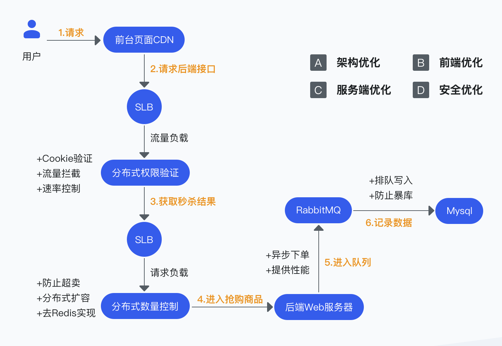
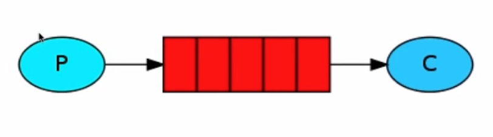
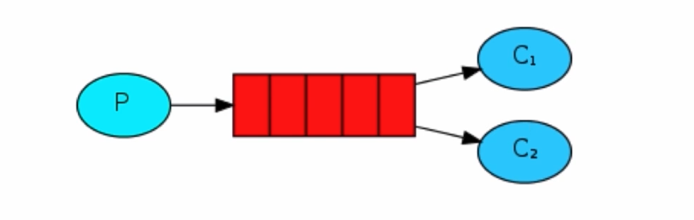
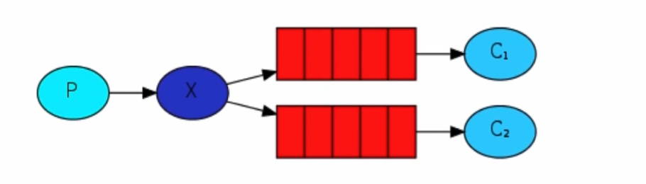
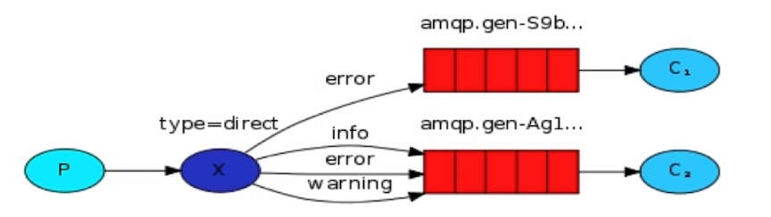
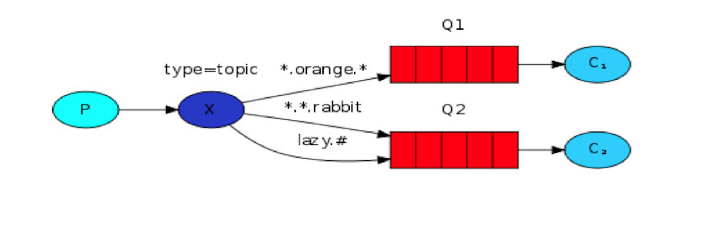

# Go 秒杀系统

## RabbitMQ

- 定义：是面向消息的中间件，用于组件之间的解耦，主要体现在消息的发送者和消费者之间无强依赖关系
- 特点：高可用、扩展性、多语言客户端、管理界面等
- 主要使用场景：流量削峰、异步处理、应用解耦等

### 命令

- 启动：`rabbitmq-server`
- 停止：`rabbitmqctl stop`
- 插件：`rabbitmq-plugins`
  - `list`
  - `enable`
  - `disable`

### 核心概念

- Virtual Hosts：区分队列、隔离环境
- Connection：
- Exchange：交换机，中转，生产者发送消息后先进入交换机，然后发送到对应的 queue 里面
- Channel：
- Queue：临时存储消息
- Binding：队列绑定到交换机

### 工作模式

- Simple：

    

- Work：

    

    - 一个消息只能被一个消费者获取（只能被消费一次）
    - 场景：生产速度 > 消费速度
    - 起到负载均衡的作用

- Publish/Subscribe：

    

    - 消息被路由投递给多个队列，一个消息被多个消费者获取
    - 生产端不能指定消费者

- Routing：

    

    - 一个消息可以由多个消费者获取，并且消息的目标队列可以被生产者指定

- Topic：

    

    - 一个消息被多个消费者获取，消息的目标 queue 可用 BindingKey 以通配符
        - `#`：一个或多个词
        - `*`：一个词
